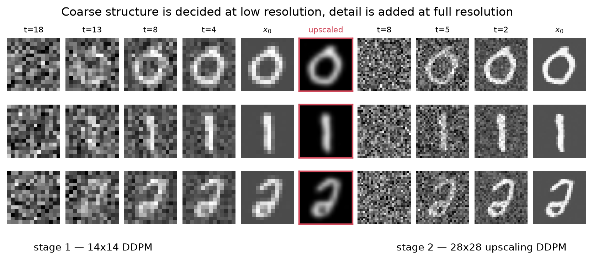
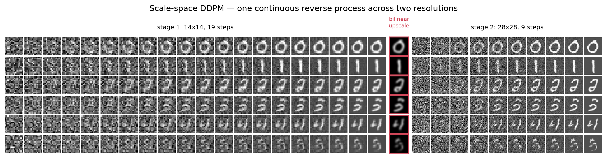
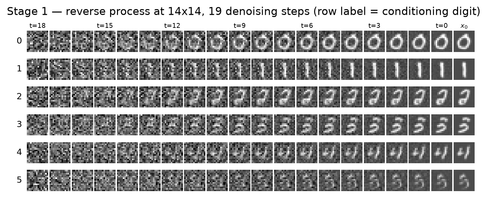
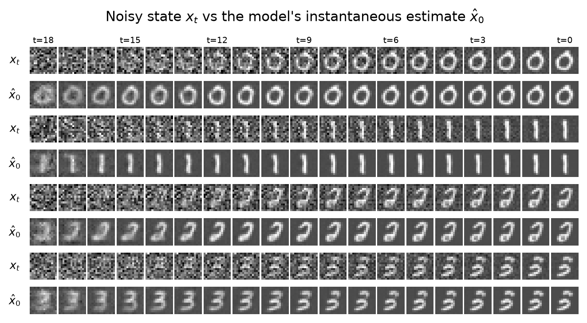
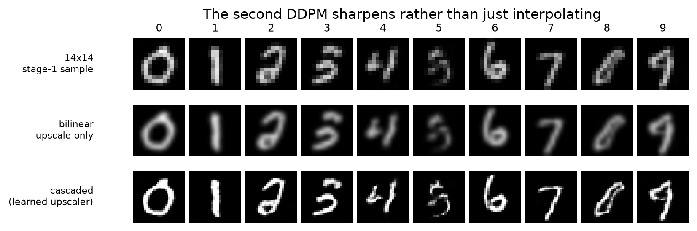
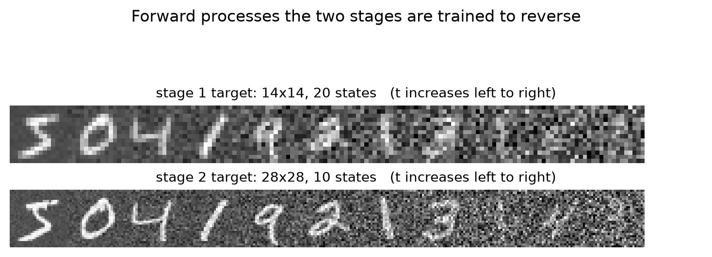
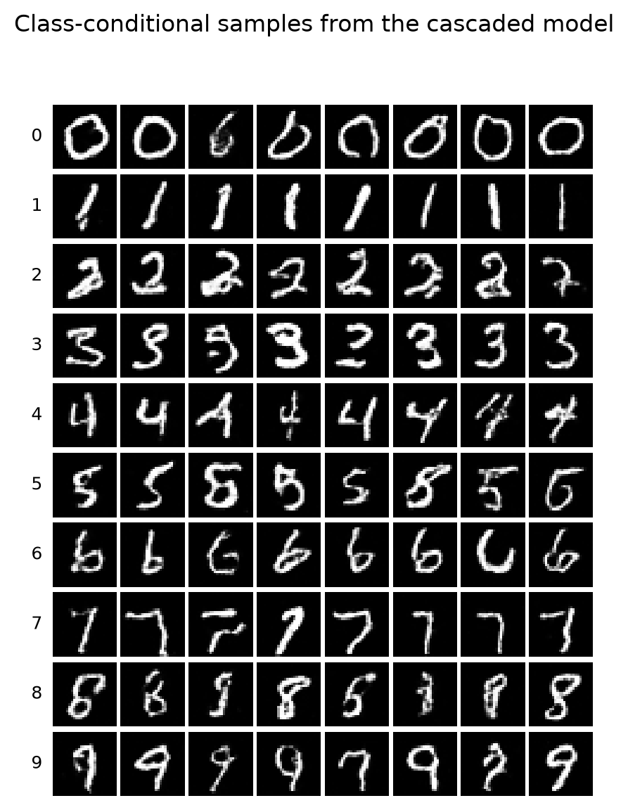
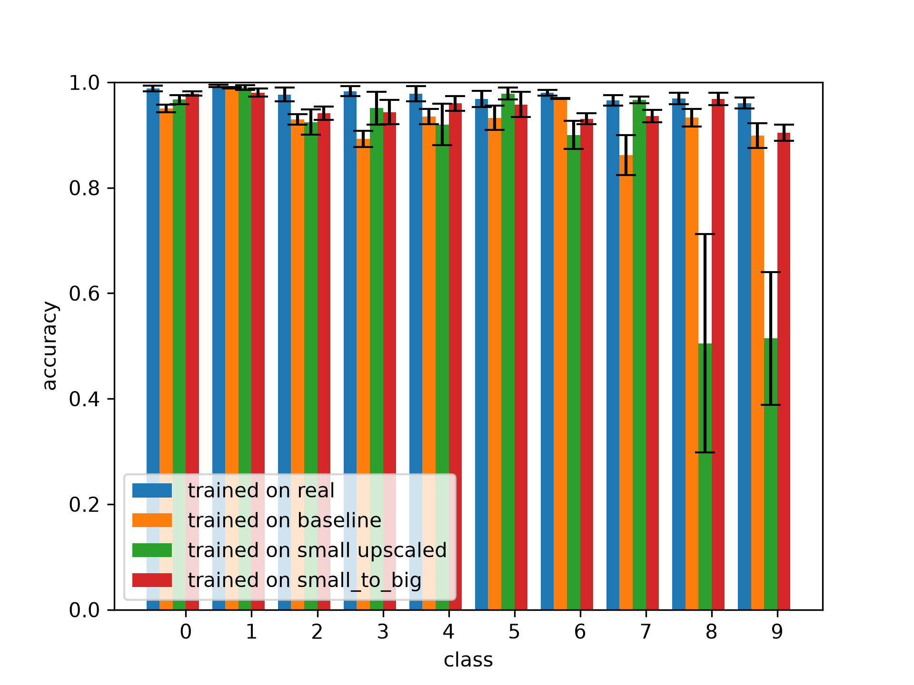

### Scale-space DDPM Training and Inference

In this university project, I experimented with different ways of more efficiently training and sampling from DDPMs by decomposing the usual forward process into two halves with differing resolutions, as the initial stages (probably) do not need the full detailed representation to get going.

For the final written report, see [this PDF](https://github.com/Whatisthisname/scale_space_denoising_diffusion_pm/blob/main/report.pdf).

## The idea

A standard DDPM runs its entire reverse process at the target resolution. Every one of the T denoising steps pays for all 28×28 pixels, even the earliest steps whose only real job is to decide the rough shape of the digit. That looks wasteful: the coarse layout of a digit is low-frequency information, and low-frequency information does not need a fine grid to represent it.

So the reverse process is split into two phases at different scales, much like a [scale space](https://en.wikipedia.org/wiki/Scale_space) or image pyramid:

1. **`small`**: an ordinary class-conditional DDPM that runs entirely at 14×14 and produces a complete but coarse digit. Cheap, because each step touches a quarter as many pixels.
2. **`upscaler`**: a second DDPM at 28×28 whose reverse process is conditioned on the bilinearly upscaled output of stage 1, supplied as a second input channel. It starts from fresh noise at full resolution and uses the blurry image as a guide, so it learns to add detail rather than to invent a digit from nothing.

Composed, they define `p(x0) = ∫ p_upscaler(x0 | z0') p_small(z0) dz0`, where `z0'` is the upscaled low-resolution sample. The two stages together use 20 + 10 states, matching the 30 of a single-model baseline, so the comparison is like for like.

Here is one continuous chain, left to right, for three conditioning labels. Stage 1 generates the shape at low resolution, the red panel is the plain bilinear upscale handed over as conditioning, and stage 2 sharpens it at full resolution:



Here is the progression of every state of both stages, for six samples:



## Denoising at low resolution

Stage 1 on its own. Each row is one sample conditioned on the digit at the left, and each column is one step of the reverse process, from pure gaussian noise to a finished 14×14 digit:



A DDPM predicts the noise in its current state, which can be rearranged into a guess at the finished image at any point along the way. Those guesses are recognisable far earlier than the noisy states themselves, which is the intuition behind spending the early steps cheaply:



## What the second stage actually contributes

The obvious baseline for stage 2 is to skip the learned upscaler and just interpolate. Bilinear upscaling gives a blurry digit; the second DDPM instead recovers stroke edges and thin structure:



This matters most for digits whose identity lives in fine detail. In the results table below, plain bilinear upscaling holds up well on most classes but collapses on **8** and **9**, where the distinguishing structure is lost at 14×14. The learned upscaler recovers exactly those classes.

Each stage is trained to reverse a different forward process. Note that with only 10 states, stage 2's noisiest state is not quite pure noise:



## Samples

Class-conditional samples from the full cascade:



## Results

Sample quality is measured with Classifier Accuracy Score (CAS): train a classifier purely on generated data, then score it on real MNIST test data. Higher is better, and the classifier trained on real data is the ceiling.

| Trained on | CAS | seconds / sample |
| --- | --- | --- |
| real MNIST | 0.976 ± 0.010 | — |
| baseline (single 28×28 DDPM, 30 states) | 0.929 ± 0.015 | 0.080 |
| `small` + bilinear upscale | 0.862 ± 0.048 | 0.047 |
| **cascaded** (`small` + `upscaler`) | **0.950 ± 0.013** | 0.073 |



The scale-space decomposition comes out ahead of the single-model baseline on both quality and speed. Deterministically upscaling the low-resolution samples is faster still and remarkably competitive for how little it costs, but it pays for that on the classes that need fine detail.


## Running it

```bash
pip install -r requirements.txt
make full          # trains every model, samples from each, then computes CAS
python3 make_figures.py   # regenerates the figures above
```

Training picks the fastest available backend automatically (CUDA, then Apple Silicon MPS, then CPU); override with `--device`. Pass `--preview_every 0` to skip the per-epoch sample GIFs, which otherwise dominate epoch time on small models.
